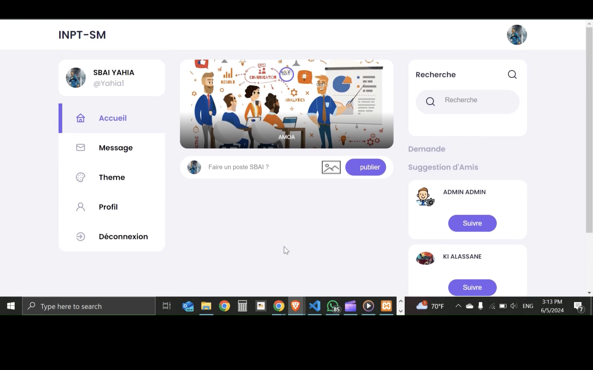
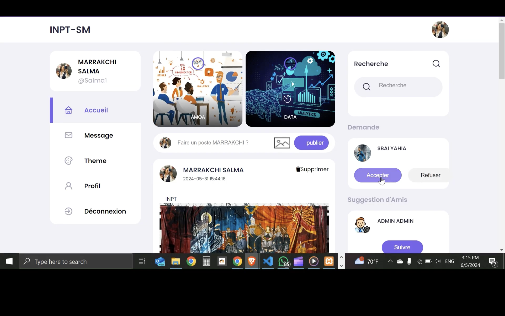
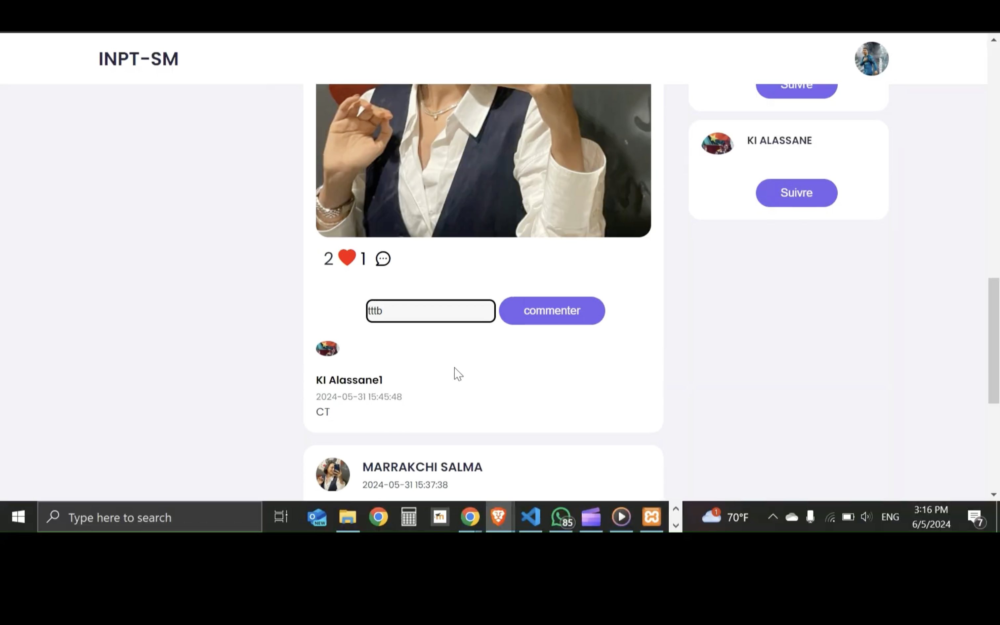
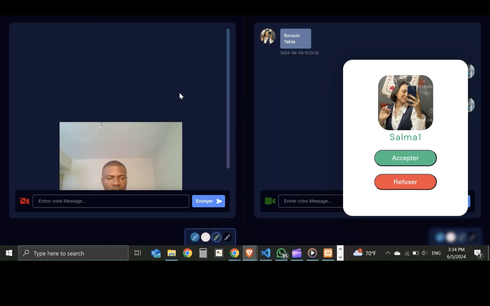
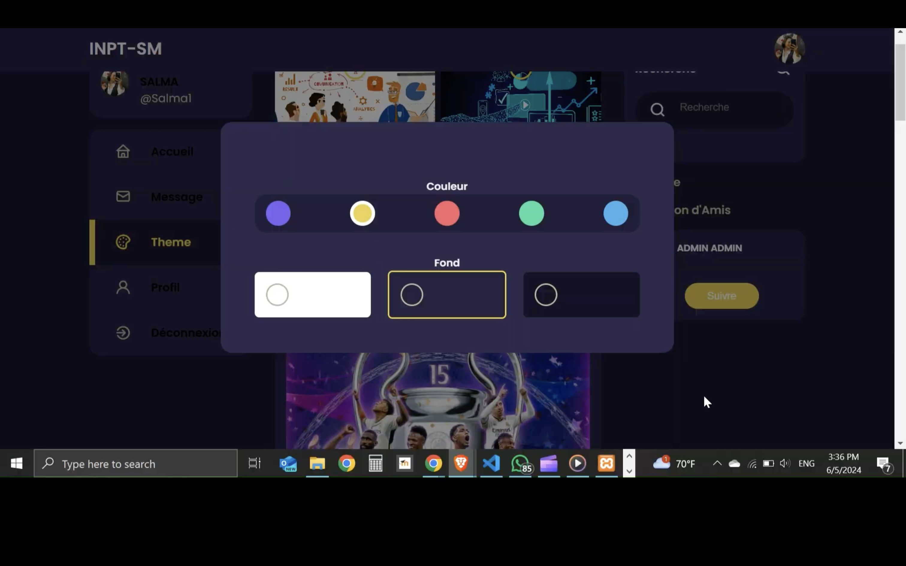

<div align="left"> <a href="./README.md">🇫🇷 Français</a> | <a href="./README.en.md">🇬🇧 English</a> </div>

---
<a name="top"></a>

<div align="center">
  
  
  
  
  
  <h1>Student Social Network - INPT Rabat</h1>
  <p>Secure Azure-deployed platform for INPT Rabat students</p>
</div>

# [Demo Video](https://drive.google.com/file/d/1Hq3J-rs-3WbeB3U-_zJQT543qtU6Qk4J/view?usp=sharing)
If the link doesn't work, please copy and paste it into your browser's address bar.

# [Azure Deployment Demo](https://drive.google.com/file/d/1HXfjf4zQNLJY7MM68mYP5deMRmBm1AKU/view?usp=sharing)
If the link doesn't work, please copy and paste it into your browser's address bar.

## Table of Contents
1. [Introduction](#introduction)
2. [Key Features](#features)
3. [Technologies Used](#tech)
4. [Local Installation](#installation)
5. [Future Improvements](#future)
6. [Demo](#demo)

---

## Introduction<a name="introduction"></a>

**INPT-SM** is a social networking platform exclusively for students of the National Institute of Posts and Telecommunications (INPT) in Rabat. Deployed on Microsoft Azure, it provides a secure environment for:

- 👥 Academic and social interactions within study groups
- 📚 Sharing educational resources
- 💬 Real-time communication via chat and video calls
- 🎨 User experience customization (themes, colors)
- 🔒 Secure and scalable cloud infrastructure

<div align="right">
  <a href="#top">⬆ Back to top</a>
</div>

---

## Key Features<a name="features"></a>

### 🎓 Student Profile
- Account creation
- Automatic assignment to study groups
- Profile customization (photo, bio, etc.)
- Preference management (colors, notifications)

### 👥 Groups & Communities
- Automatic integration with study groups
- Search and join other groups
- Group creation
- Member management

### 📢 Posts & Interactions
- Create/edit/delete posts
- Comments and reactions (likes)
- Document and image sharing
- Personalized news feed

### 💬 Real-time Communication
- Instant messaging between students
- WebRTC video calls
- Contact and friend management

### 🎨 Customization
- Color scheme selection (light/dark theme)
- Responsive interface for all devices

<div align="right">
  <a href="#top">⬆ Back to top</a>
</div>

---

## Technologies Used<a name="tech"></a>

<div align="center">
  
  
  
  
  
  
  
</div>

### Frontend
- **HTML** - Page structure
- **CSS** - Styling and animations
- **JavaScript** - Interactivity
- **Bootstrap** - Responsive framework
- **jQuery** - DOM manipulation and AJAX

### Backend
- **PHP** - Business logic
- **MySQL** - Database

### Communication
- **WebSocket** - Real-time chat
- **WebRTC** - Video calls
- **AJAX** - Asynchronous updates

### Infrastructure
- **Azure App Service** - Web hosting

<div align="right">
  <a href="#top">⬆ Back to top</a>
</div>

---

## Local Installation<a name="installation"></a>

### Prerequisites
- XAMPP (Apache, MySQL, PHP)

### Installation Steps
1. **Clone the repository**
   ```bash
   git clone https://github.com/Alidou26/INPT-Social-Media.git
   cd INPT-Social-Media
   ```
   ## Installation<a name="installation"></a>

### Configure the database
- Import `inpt_sm.sql` into phpMyAdmin
- Configure access credentials in `BaseDeDonnees.php`

### Start the server
- Launch Apache and MySQL via XAMPP
- Access at [http://localhost/INPT-Social-Media](http://localhost/INPT-Social-Media)

<div align="right">
  <a href="#top">⬆ Back to top</a>
</div>

## Future Improvements<a name="future"></a>
- 📱 Native mobile app (React Native)
- 📚 Moodle integration (educational resources & quiz system)
- 📅 Shared academic calendar
- 🔍 Advanced search engine
- 🤖 Content recommendation system
- 🛡️ Enhanced security (2FA)
- 🤖 AI moderation (Automatic inappropriate content detection)

<div align="right">
  <a href="#top">⬆ Back to top</a>
</div>

## Demo<a name="demo"></a>











<div align="right">
  <a href="#top">⬆ Back to top</a>
</div>
