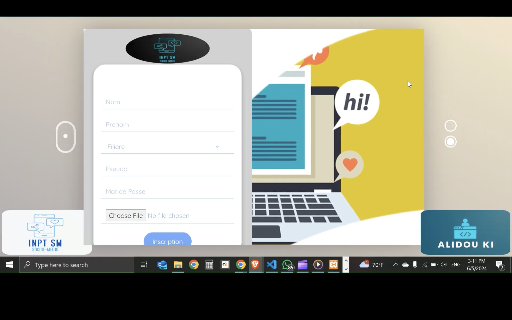
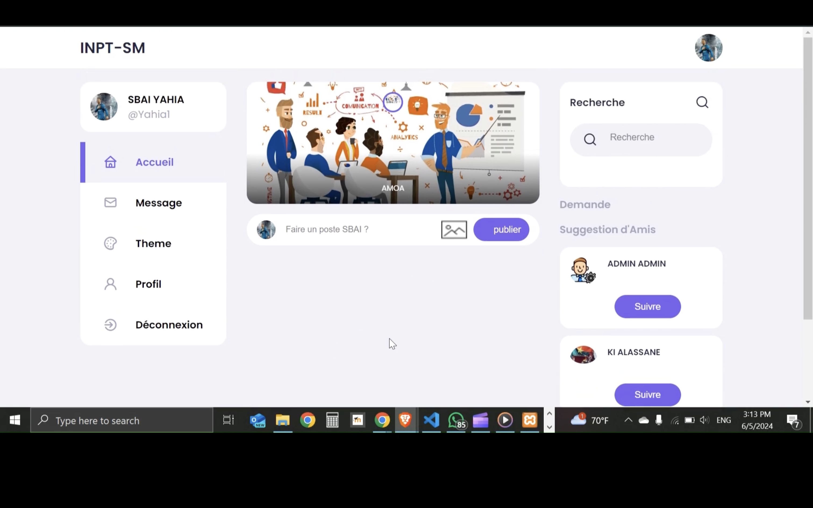
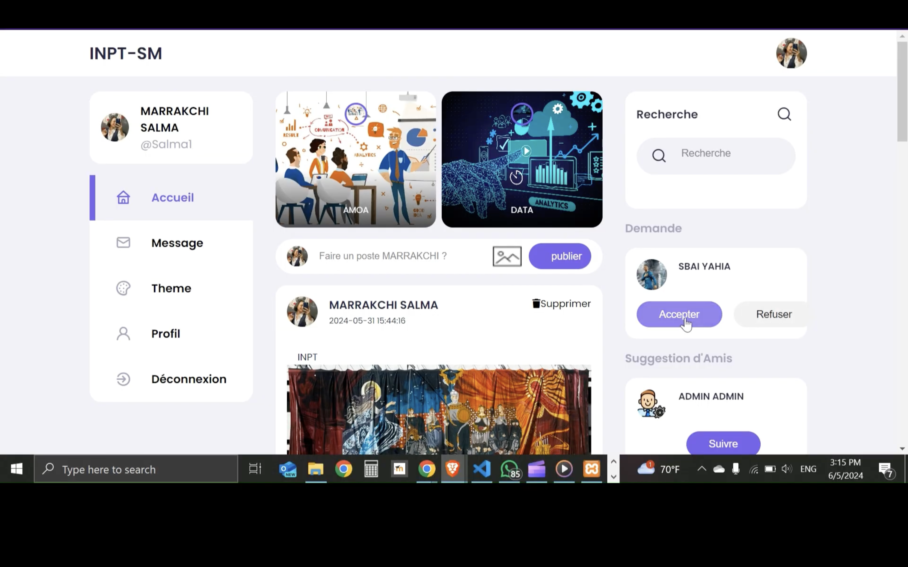
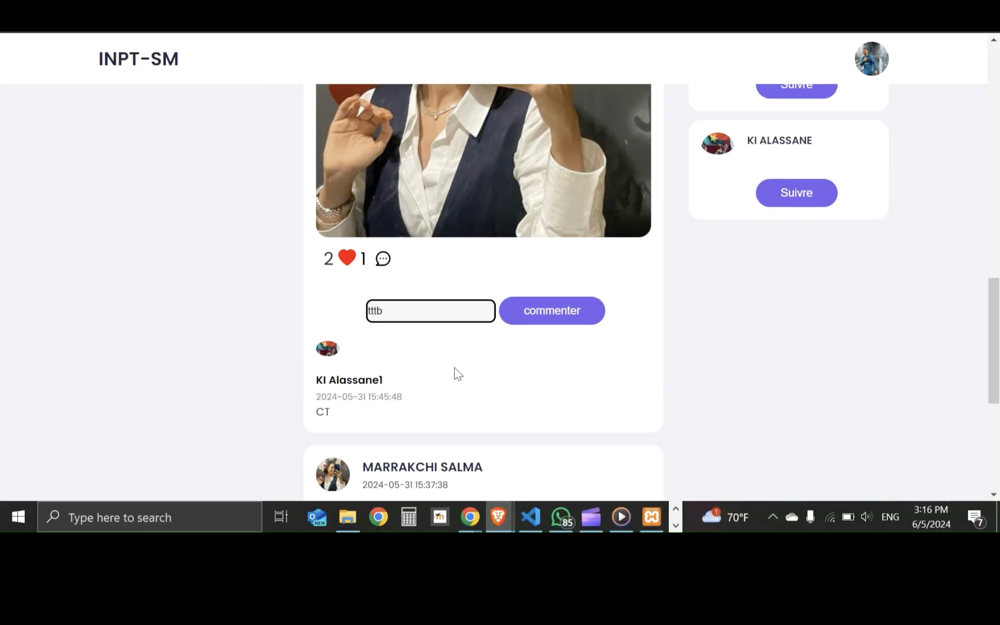
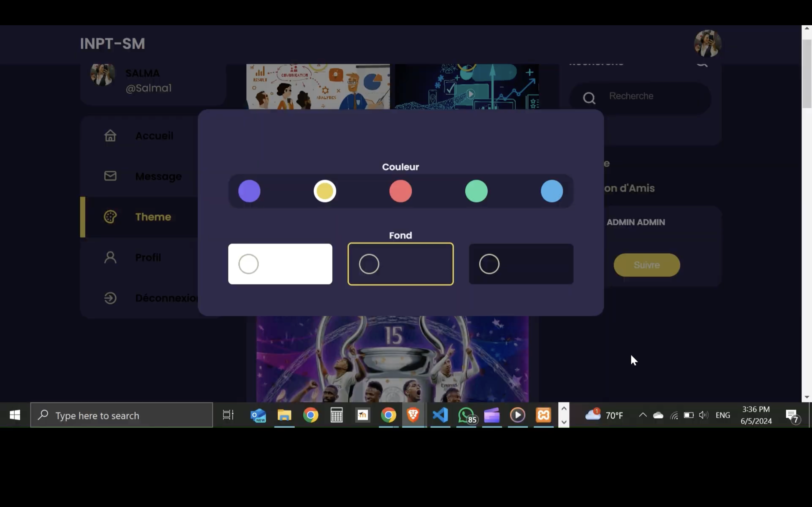

<div align="left"> <a href="./README.md">🇫🇷 Français</a> | <a href="./README.en.md">🇬🇧 English</a> </div>

---
<a name="top"></a>

<div align="center">
  
  
  
  
  
  <h1>Réseau Social Étudiant - INPT Rabat</h1>
  <p>Plateforme sécurisée déployée sur Azure pour les étudiants de l'INPT Rabat</p>
</div>

# [Video Démonstration](https://drive.google.com/file/d/1Hq3J-rs-3WbeB3U-_zJQT543qtU6Qk4J/view?usp=sharing)
Si le lien ne marche pas, considérez de copier lien et de le coller dans la barre de recherche.

# [Vidéo Démo de la partie Azure](https://drive.google.com/file/d/1HXfjf4zQNLJY7MM68mYP5deMRmBm1AKU/view?usp=sharing)
Si le lien ne marche pas, considérez de copier lien et de le coller dans la barre de recherche.

## Table des Matières
1. [Introduction](#introduction)
2. [Fonctionnalités Clés](#features)
3. [Technologies Utilisées](#tech)
4. [Installation Locale](#installation)
5. [Améliorations Futures](#future)
6. [Démo](#demo)

---

## Introduction<a name="introduction"></a>

**INPT-SM** est une plateforme de réseau social dédiée exclusivement aux étudiants de l'INSTITUT NATIONAL DES POSTES ET TELECOMMUCIATIONS de Rabat. Déployée sur Microsoft Azure, elle offre un environnement sécurisé pour :

- 👥 Les échanges académiques et sociaux au sein de groupes de filière
- 📚 Le partage de ressources pédagogiques
- 💬 La communication en temps réel via chat et appels vidéo
- 🎨 La personnalisation de l'expérience utilisateur (thèmes, couleurs)
- 🔒 Une infrastructure cloud sécurisée et scalable

<div align="right">
  <a href="#top">⬆ Retour en haut</a>
</div>

---

## Fonctionnalités Clés<a name="features"></a>

### 🎓 Profil Étudiant
- Création de compte
- Attribution automatique au groupe de filière
- Personnalisation du profil (photo, bio, ...)
- Édition des préférences (couleurs, notifications)

### 👥 Groupes et Communautés
- Intégration automatique au groupe de filière
- Recherche et adhésion à d'autres groupes
- Création de groupes
- Gestion des membres

### 📢 Publications et Interactions
- Création/modification/suppression de posts
- Commentaires et réactions (likes)
- Partage de documents et images
- Fil d'actualités personnalisé

### 💬 Communication Temps Réel
- Messagerie instantanée entre étudiants
- Appels vidéo via WebRTC
- Gestion des contacts et amis

### 🎨 Personnalisation
- Choix des couleurs d'affichage (thème clair/sombre)
- Interface responsive adaptée à tous appareils

<div align="right">
  <a href="#top">⬆ Retour en haut</a>
</div>

---

## Technologies Utilisées<a name="tech"></a>

<div align="center">
  
  
  
  
  
  
  
</div>

### Frontend
- **HTML** - Structure des pages
- **CSS** - Styling et animations
- **JavaScript** - Interactivité
- **Bootstrap** - Framework responsive
- **jQuery** - Manipulation DOM et AJAX

### Backend
- **PHP** - Logique métier
- **MySQL** - Base de données

### Communication
- **WebSocket** - Chat en temps réel
- **WebRTC** - Appels vidéo
- **AJAX** - Mises à jour asynchrones

### Infrastructure
- **Azure App Service** - Hébergement web


<div align="right">
  <a href="#top">⬆ Retour en haut</a>
</div>

---


## Installation<a name="installation"></a>

### Prérequis
- XAMPP (Apache, MySQL, PHP)

### Étapes d'installation
1. **Cloner le dépôt**
   ```bash
   git clone https://github.com/Alidou26/INPT-Social-Media.git
   cd INPT-Social-Media
   ```
   
2. **Configurer la base de données**

  - Importer inpt_sm.sql dans phpMyAdmin

  - Configurer les accès dans BaseDeDonnees.php
    

 3. **Démarrer le serveur**

   - Lancer Apache et MySQL via XAMPP

   - Accéder à http://localhost/INPT-Social-Media


<div align="right"> <a href="#top">⬆ Retour en haut</a> </div>

---

## Améliorations Futures<a name="future"></a>

   1. 📱 **Version mobile native (React Native)**

   2. 📚 **Intégration avec Moodle (ressources pédagogiques et Système de quizz )**

   3. 📅 **Calendrier académique partagé**

   4. 🔍 **Moteur de recherche avancé**

   5. 🤖 **Système de recommandation de contenu**

   6. 🛡️ **Renforcement de la sécurité (2FA)**

   7. 🤖 **Modération IA**(Détection automatique de contenu inapproprié)

<div align="right"> <a href="#top">⬆ Retour en haut</a> </div>

---

</div>

## Démo<a name="demo"></a>










<div align="right">
⬆ Back to top

</div>
